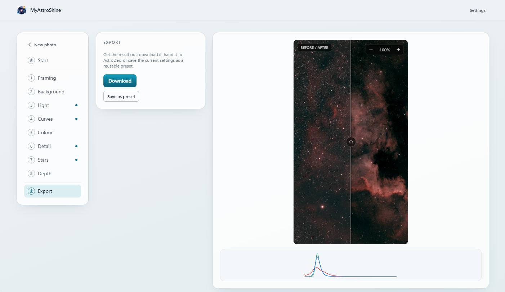

# MyAstroShine

[](https://github.com/myastroboard/myastroshine/releases)
[](https://github.com/myastroboard/myastroshine/actions/workflows/ci.yml)
[](https://www.astropy.org/)
[](https://hub.docker.com/r/myastroboard/myastroshine)
[](https://hub.docker.com/r/myastroboard/myastroshine)
[](LICENSE)

**A self-hosted astronomical image processing tool: automatic enhancement,
multi-image stacking, and a parallax depth effect - from one Docker image, with
no account and no cloud upload.** It integrates optionally with
[MyAstroBoard](https://github.com/myastroboard/myastroboard)'s Astrodex - send a
photo over for enhancement, get it back as a new picture on the same object - and
runs just as well standalone, in a web browser.



## Contents

- [MyAstroShine](#myastroshine)
  - [Contents](#contents)
  - [What it does](#what-it-does)
  - [Quick start (Docker)](#quick-start-docker)
  - [Local development](#local-development)
    - [Backend](#backend)
    - [Frontend](#frontend)
    - [Checks (what CI runs)](#checks-what-ci-runs)
  - [Documentation](#documentation)
  - [Technology](#technology)
  - [Contributing](#contributing)
  - [About](#about)

## What it does

- **Automatic enhancement** - a workflow-ordered editor: framing, background
  corrections (white balance, vignette, light-pollution gradient, dehaze), tone,
  master + per-channel **curves**, colour, detail (clarity, luma / colour
  denoise, sharpen).
- **One-click Auto Astro** - measures the sky, the object, the noise and the stars
  and applies an edit that showcases the picture, never clipping the sky. Plus five
  built-in **presets** and your own.
- **Star handling** - shrink stars in place, or lift them out entirely (starless
  workflow) and screen-blend them back at the end.
- **Geometry** - rotate, flip, straighten, crop, before the pixel pipeline runs.
- **Depth Shift** - a multi-layer parallax effect that gives a single frame a
  sense of 3D depth, with a pickable focal point.
- **Stacking** - align and combine 2-2000 linear frames: master dark / flat /
  bias calibration, per-frame quality scoring and auto-reject, asterism-matching
  registration, sigma-clipped weighted combination, optional drizzle - all in
  bounded memory, plus a folder-watch mode for a live capture rig.
- **Optional ML engines** - point it at an operator-installed
  [StarNet2](https://starnetastro.com/) / DeepSNR binary for star removal and
  denoise (**nothing is bundled** - see [THIRD_PARTY.md](THIRD_PARTY.md)).
- **Wide input support** - 8/16-bit JPEG/PNG/TIFF, FITS, and camera RAW.
- **Go-back points** (a one-click safety net), **English + French** UI, light / dark themes.
- **Astrodex integration** - open a photo straight from MyAstroBoard's Astrodex
  with a signed handoff, enhance it here, then send it back as a new picture on
  the same object (the original is never touched). Or work fully standalone:
  upload, edit, download.

A full tour is in [docs/FEATURES.md](docs/FEATURES.md).

**Why this tool?** Something simple and quick that still gives nice results: no
complex pipeline, no cloud dependency, my data under my control.

**Does it replace PixInsight / Siril?** No, and that isn't the goal - think of it
as a fast, self-hosted companion for everyday enhancement.

## Quick start (Docker)

No `.env` editing required - the compose file carries only structural variables,
and everything tunable is set from **Settings** in the UI (stored on the data
volume).

```bash
curl -O https://raw.githubusercontent.com/myastroboard/myastroshine/main/docker-compose.yml
docker compose up -d          # pulls the published image

curl http://localhost:8002/api/health
open  http://localhost:8002
```

One image serves both the API and the web UI. `docker compose up -d` pulls the
published image; if you cloned the repo, `docker compose up -d --build` builds
from the local `Dockerfile` instead. Pin a version with
`MYASTROSHINE_VERSION=0.2.0 docker compose up -d`.

Then open **Settings** once to create the admin password. Using the app is open
to anyone who reaches it; only Settings is reserved for the administrator (see
[SECURITY.md](SECURITY.md)).

For development with hot reload (uvicorn `--reload` + Vite HMR, source
bind-mounted):

```bash
docker compose -f docker-compose.dev.yml up
```

Full deployment reference: [docs/DEPLOYMENT.md](docs/DEPLOYMENT.md).

## Local development

### Backend

```bash
cd backend
python -m venv .venv
source .venv/bin/activate       # Windows: .venv\Scripts\activate
pip install -r requirements.txt -r requirements-dev.txt
uvicorn app.main:app --reload --port 8002
pytest
```

### Frontend

```bash
cd frontend
npm install
npm run dev                     # Vite dev server on :3000
```

### Checks (what CI runs)

```bash
cd backend  && ruff format --check . && ruff check . && mypy app && pytest
cd frontend && npm run lint && npm run typecheck && npm test && npm run build
python scripts/check_deps_fresh.py     # every dependency pinned to its latest release
python scripts/validate_i18n.py        # if you touched frontend UI text
```

`CONTRIBUTING.md` has the full workflow; `AGENTS.md` the hard rules.

## Documentation

| | |
|---|---|
| [docs/FEATURES.md](docs/FEATURES.md) | What every feature does, step by step |
| [docs/ARCHITECTURE.md](docs/ARCHITECTURE.md) | Services, request flow, storage, module boundaries |
| [docs/API.md](docs/API.md) | HTTP + WebSocket contract, parameters, errors |
| [docs/ALGORITHMS.md](docs/ALGORITHMS.md) | The image-processing and stacking maths |
| [docs/DEPLOYMENT.md](docs/DEPLOYMENT.md) | Configuration, the data volume, ML engines, migrations |
| [docs/TROUBLESHOOTING.md](docs/TROUBLESHOOTING.md) | Common problems |
| [docs/DESIGN.md](docs/DESIGN.md) | The frontend visual system |
| [CHANGELOG.md](CHANGELOG.md) | What has landed, and what is still open |

The docs index is [docs/README.md](docs/README.md).

## Technology

- **Backend** - FastAPI, Python 3.14, OpenCV, Pillow, NumPy, astropy (FITS),
  rawpy/libraw (camera RAW)
- **Frontend** - React 19, TypeScript, Vite, Tailwind CSS v4
- **Jobs** - in-process background threads, progress over WebSockets (no queue or Redis)
- **Storage** - local filesystem + SQLite (Alembic migrations; Postgres-ready)
- **Packaging** - one multi-arch Docker image (`linux/amd64`, `linux/arm64`)

The API listens on port **8002**. Repository layout:

```
myastroshine/
|-- backend/     FastAPI + OpenCV image-processing engine
|-- frontend/    React + TypeScript + Vite single-page app
|-- docs/        architecture, API, algorithms, deployment, design
|-- engines/     optional operator-installed ML binaries (git-ignored, nothing bundled)
|-- scripts/     maintenance scripts (dependency freshness, i18n parity, changelog)
|-- docker-compose.yml / docker-compose.dev.yml
```

## Contributing

Issues and pull requests welcome - see [CONTRIBUTING.md](CONTRIBUTING.md) and
[AGENTS.md](AGENTS.md) first. Report a bug or request a feature through the
[issue templates](https://github.com/myastroboard/myastroshine/issues/new/choose);
security reports go through the [security policy](SECURITY.md), not a public
issue.

## About

MyAstroShine is developed with the help of
[Claude Code](https://claude.com/claude-code). Architecture and design decisions,
review, and every merge to `main` are done by the human maintainer.

Licensed under [AGPL-3.0-or-later](LICENSE).
